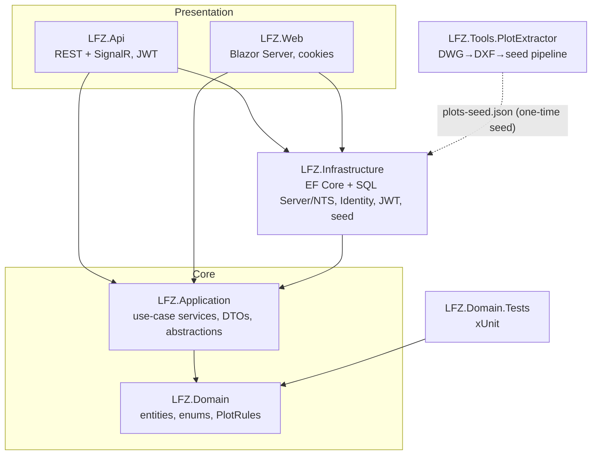
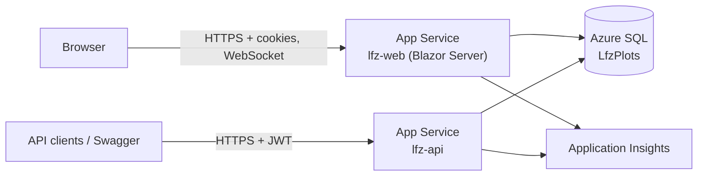

# LFZ Plot Management — Architecture

## 1. Solution layout (clean architecture)

**Dependency rule.** `LFZ.Domain` depends on nothing (NetTopologySuite only, for
geometry value types). `LFZ.Application` depends on Domain and defines the
persistence abstraction (`IApplicationDbContext`) plus `IJwtService`.
`LFZ.Infrastructure` implements those abstractions with EF Core (SQL Server +
NetTopologySuite), ASP.NET Core Identity and JWT issuance. The two hosts (API,
Web) compose everything via `AddLfzInfrastructure`.

**Where logic lives.**

| Concern | Location |
| --- | --- |
| Status workflow invariants (who may move a plot between states) | `LFZ.Domain.Rules.PlotRules` — pure, unit-tested |
| Command orchestration (submit/approve/reject/allocate/block/release) | `LFZ.Application.Services.PlotCommandService` |
| Read models & filters | `LFZ.Application.Services.PlotQueryService` |
| Status audit trail | `PlotStatusHistoryInterceptor` (EF `SaveChanges` interceptor) — every persisted status change writes a `PlotStatusHistory` row with actor, reason and originating request |
| Real-time map refresh | `PlotHub` (SignalR) broadcast on every status change |

## 2. Deployment topology (Azure)

Both apps share one Linux App Service plan and one Azure SQL database.
Templates: [deploy/main.bicep](../deploy/main.bicep). Blazor Server requires
WebSockets (enabled in the template). Scale-out beyond one Web instance
requires adding a SignalR/backplane service (Azure SignalR) for sticky circuits.

## 3. Security model

- **Authentication** — ASP.NET Core Identity over the shared database.
  - `LFZ.Api`: stateless JWT bearer (issuer/audience/key from configuration,
    60-minute expiry, role claims embedded). SignalR clients pass the token via
    `access_token` query parameter.
  - `LFZ.Web`: Identity cookie (8 h sliding), login via antiforgery-protected
    form post; Blazor circuits inherit the authenticated `ClaimsPrincipal`.
- **Authorization** — four roles (Viewer, Requester, Allocator, Admin) mapped to
  named policies defined once in `DependencyInjection.AddLfzPolicies` and used
  by both hosts:

  | Policy | Roles | Grants |
  | --- | --- | --- |
  | `CanViewDashboard` | all four | read map, dashboard, summaries |
  | `CanRequestPlot` | Requester, Allocator, Admin | submit plot requests |
  | `CanAllocatePlot` / `CanBlockPlot` | Allocator, Admin | approve/reject, direct allocate, block |
  | `CanManageSettings` | Admin | release plots, edit plots/settings, register users |

  A **fallback policy** requires authentication everywhere; anonymous access is
  opt-in (`/login`, `/api/auth/login`).
- **Hardening** — lockout after 5 failed logins (15 min), password policy
  (min 6, digit required), HTTPS-only, TLS 1.2 minimum, secrets supplied via
  parameters/Key Vault references (never committed), EF Core parameterised
  queries throughout, optimistic concurrency via `rowversion` on `Plots`.

## 4. Non-functional targets

| Target | Approach |
| --- | --- |
| Map render < 1 s for ~60 plots | SVG paths pre-computed at seed time; no client transform; single query with `AsNoTracking` |
| Status change visible to all users < 2 s | SignalR broadcast on every transition |
| Auditability | Immutable `PlotStatusHistory` written transactionally with the change |
| Concurrency safety | `rowversion` column + EF concurrency checks; single SaveChanges per command |
| Maintenance is data-only | Drawing changes → re-run `LFZ.Tools.PlotExtractor`; tenants/statuses/settings via Admin UI; no code changes |
| Availability | Stateless API; Blazor Server on WebSockets; Azure SQL S0 with point-in-time restore |
