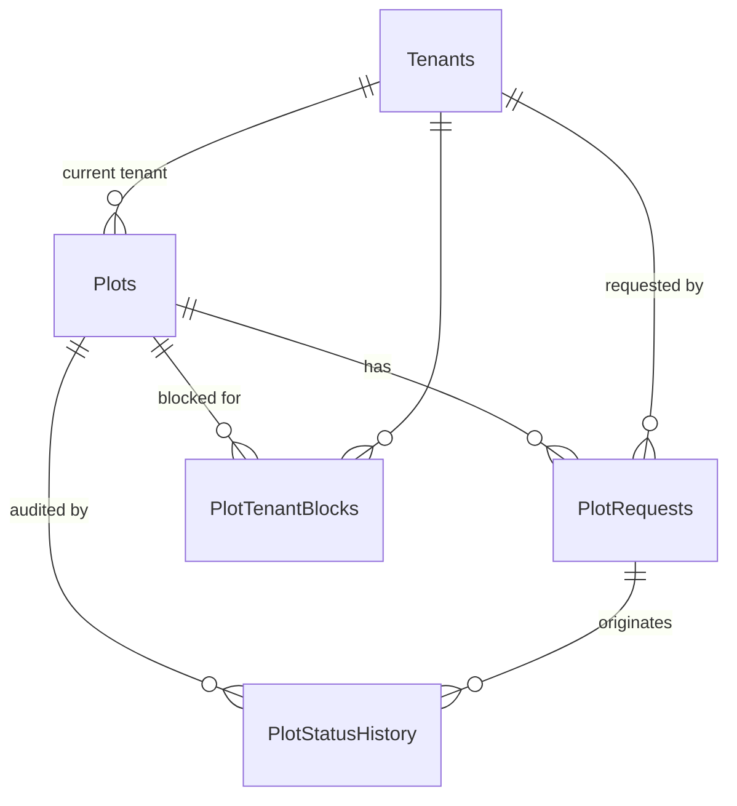

# LFZ Plot Management — Database schema

SQL Server database `LfzPlots`. Created by EF Core migration `InitialSchema`
(`src/LFZ.Infrastructure/Migrations`). Identity tables (`AspNetUsers`,
`AspNetRoles`, …) are standard and omitted here; `AspNetUsers` is extended with
`FullName` and `RoleFlag`.

## Plots

| Column | Type | Notes |
| --- | --- | --- |
| Id | int PK identity | |
| Code | nvarchar(50), unique index | stable drawing code (`i001`, `cp01`, `IND-nnn`) |
| DisplayName | nvarchar(200) | |
| LandUseType | nvarchar(100) | Industrial / Infrastructure / Existing / … |
| Phase | nvarchar(100) null | |
| HatchColor | nvarchar(20) null | override colour from drawing hatch |
| AreaHectares | decimal(18,4) | |
| Status | nvarchar(50) | enum string: Free, Occupied, Blocked, PendingReview, Unavailable |
| CurrentTenantId | int null FK → Tenants | `ON DELETE SET NULL` |
| Boundary | geometry null | polygon, plan metres, SRID 0 — supports `STContains`, `STTouches`, `STArea` |
| SvgPath | nvarchar(max) null | pre-computed, y-flipped, plan metres; rendered directly |
| Centroid | geometry null | point, same coordinate space as SvgPath |
| IsLocked | bit | roads/common areas — non-selectable |
| MultiTenantBlockEnabled | bit | per-plot gate for the multi-tenant block exception |
| RowVersion | rowversion | optimistic concurrency |

## Tenants

| Column | Type |
| --- | --- |
| Id | int PK identity |
| Name | nvarchar(200) |
| LegalName | nvarchar(200) null |
| Contact | nvarchar(500) null |
| Industry | nvarchar(120) null |

## PlotRequests

| Column | Type | Notes |
| --- | --- | --- |
| Id | int PK identity | |
| PlotId | int FK → Plots (cascade) | index on (PlotId, Status) |
| TenantId | int FK → Tenants (restrict) | |
| RequestedByUserId | nvarchar(450) | Identity user id |
| RequestType | nvarchar(50) | Allocate / Block |
| Status | nvarchar(50) | Pending / Approved / Rejected / Cancelled |
| IntendedUse | nvarchar(1000) null | |
| RequestedStartDate | date null | |
| DecisionByUserId | nvarchar(450) null | |
| DecisionAtUtc | datetime2 null | |
| Notes | nvarchar(2000) null | |
| CreatedAtUtc | datetime2 | |

## PlotTenantBlocks

Composite PK (PlotId, TenantId). Reserves a plot for one or more prospective
tenants; multiple rows per plot only when the multi-tenant exception is enabled
globally (AppSetting) *and* per-plot.

| Column | Type |
| --- | --- |
| PlotId | int FK → Plots (cascade) |
| TenantId | int FK → Tenants (restrict) |
| BlockedByUserId | nvarchar(450) null |
| BlockedAtUtc | datetime2 |
| Notes | nvarchar(1000) null |

## PlotStatusHistory

Immutable audit trail, written automatically by `PlotStatusHistoryInterceptor`
whenever a plot status change is persisted. Index on (PlotId, ChangedAtUtc).

| Column | Type |
| --- | --- |
| Id | int PK identity |
| PlotId | int FK → Plots (cascade) |
| FromStatus / ToStatus | nvarchar(50) |
| TenantId | int null FK → Tenants (restrict) |
| ActorUserId | nvarchar(450) |
| ChangedAtUtc | datetime2 |
| Reason | nvarchar(1000) null |
| OriginatingRequestId | int null FK → PlotRequests (no action) |

## AppSettings

Admin-editable key/value store (unique index on Key). Seeded keys:
`Feature.AllowMultiTenantBlock` (Boolean) and `Palette.Plot.*` colours used by
the map.

## Seeding

`SeedData.InitializeAsync` runs at startup of either host and is idempotent:
roles, one pilot account per role, default AppSettings, and — only when `Plots`
is empty — the 55 parcels from `Seed/plots-seed.json` including `Boundary`
geometry parsed from WKT.
